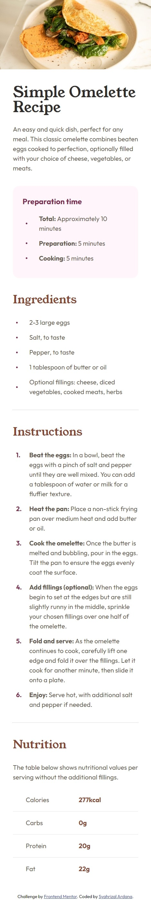
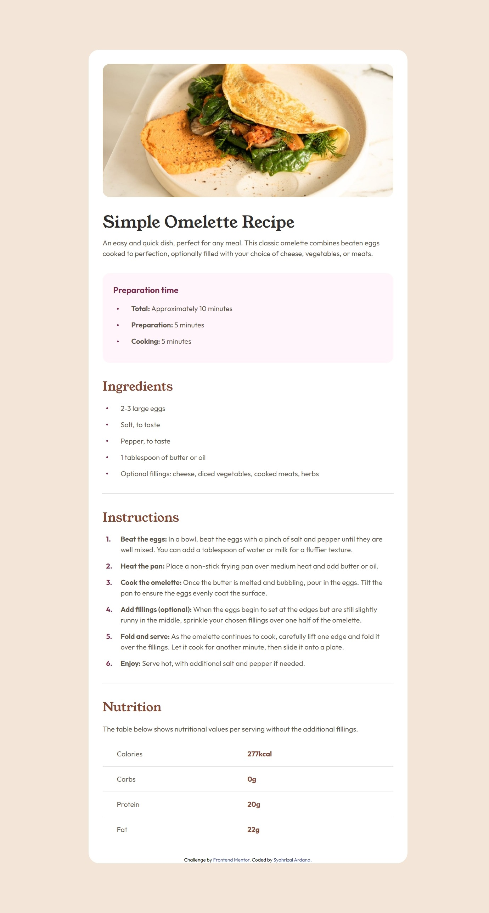

# Frontend Mentor - Recipe page solution

This is a solution to the [Recipe page challenge on Frontend Mentor](https://www.frontendmentor.io/challenges/recipe-page-KiTsR8QQKm). Frontend Mentor challenges help you improve your coding skills by building realistic projects.

## Table of contents

- [Overview](#overview)
  - [Screenshot](#screenshot)
  - [Links](#links)
- [My process](#my-process)
  - [Built with](#built-with)
  - [What I learned](#what-i-learned)
- [Author](#author)

## Overview

### Screenshot



#

---

#



### Links

- Solution URL: [https://www.frontendmentor.io/solutions/recipe-page-flexbox-scss-media-query-MLlmkc0CKF](https://www.frontendmentor.io/solutions/recipe-page-flexbox-scss-media-query-MLlmkc0CKF)
- Live Site URL: [https://fm-recipe-page-eight.vercel.app](https://fm-recipe-page-eight.vercel.app)

## My process

### Built with

- Semantic HTML5 markup
- Flexbox
- Mobile-first workflow
- [SCSS](https://sass-lang.com/) - For styles

### What I learned

- Instead of using `<ul></ul>` or `<ol></ol>` tag to make a list, try using `<div></div>` tag like so:

```html
<div class="lists">
  <div class="list">
    <div class="dot"></div>
    <div>2-3 large eggs</div>
  </div>
</div>
```

```css
.list {
  display: flex;
  flex-direction: row;
  align-items: center;
  gap: 1.1rem;
  color: $Wenge-Brown;
  margin-bottom: 0.8rem;
  .no {
    color: $Dark-Raspberry;
    font-weight: bold;
    min-width: 15px;
  }
  .dot {
    min-width: 0.25rem;
    min-height: 0.25rem;
    border-radius: 50%;
    background-color: $Dark-Raspberry;
  }
  :nth-child(2) {
    margin-left: 0.7rem;
  }
}
```

- When u applied `border-radius` to an image then add padding to it, will broken the display, do this instead:

```html
<header>
  
</header>
```

```css
header {
  .header-image {
    width: 100%;
    @include mediaQuery(minTablet) {
      border-radius: 1rem;
    }
  }
  @include mediaQuery(minTablet) {
    margin: 2rem;
    padding-top: 2rem;
  }
}
```

## Author

- Website - [Syahrizal Ardana](https://syahrizal-portfolio.vercel.app)
- Frontend Mentor - [@Gombeng](https://www.frontendmentor.io/profile/Gombeng)
